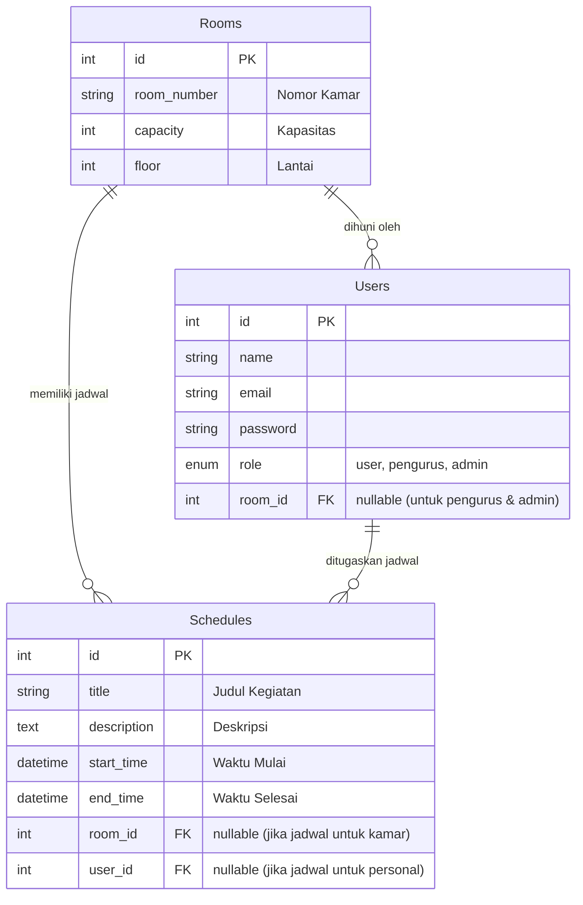

# Alur Diagram Database (ERD)

Dokumen ini memuat visualisasi struktur database (Entity Relationship Diagram) beserta alur relasinya untuk aplikasi Jadwal Asrama.

## Diagram ERD

## Penjelasan Relasi
1. **Users & Rooms (Penghuni & Kamar)**: Relasi *Many-to-One*. Banyak User dapat menghuni satu Room.
2. **Schedules & Rooms (Jadwal & Kamar)**: Relasi *Many-to-One*. Satu Room bisa memiliki banyak Schedules. Hal ini memudahkan jika ada jadwal pembersihan untuk seluruh penghuni kamar tertentu.
3. **Schedules & Users (Jadwal & Penghuni)**: Relasi *Many-to-One*. Satu User bisa memiliki banyak Schedules secara personal.
