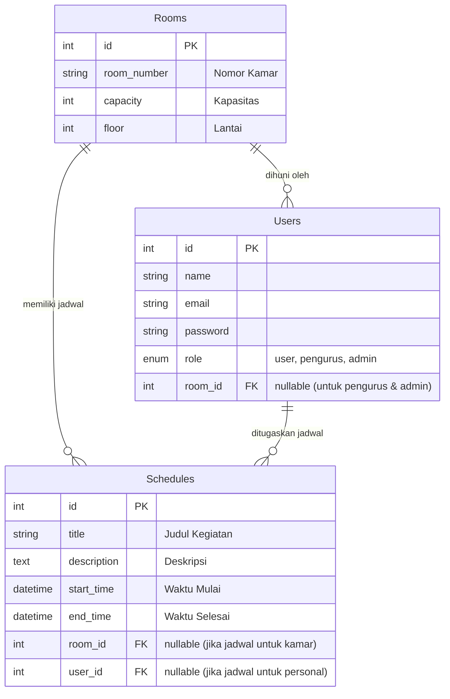

# Rencana Implementasi: Jadwal Asrama

Dokumen ini merangkum rencana fitur, alur database, serta langkah-langkah pengerjaan dari aplikasi Jadwal Asrama untuk peran **User** (penghuni asrama), **Pengurus**, dan **Admin**.

## 1. Urutan Pengerjaan

Sangat disarankan untuk mulai dari Skema Database dan Backend terlebih dahulu. 
Alasannya: Frontend membutuhkan data untuk ditampilkan. Jika kita membuat database dan API (Backend) terlebih dahulu, maka saat membangun UI Frontend (halaman User & Pengurus), kita sudah punya data nyata untuk diuji coba. 

Jadi urutan pengerjaannya adalah:
1. **Skema Database & Backend Models**
2. **Backend API (Routes & Controllers)** untuk fitur-fitur
3. **Frontend UI** (Pages untuk User, Pengurus, dan Admin) dan integrasi dengan Backend

---

## 2. Rencana Fitur Aplikasi

Aplikasi akan dibagi menjadi 3 halaman utama di dalam folder `frontend/src/pages/`, yaitu `User/`, `Pengurus/`, dan `Admin/`.

### 🗂️ Halaman Admin
- **Login Admin**: Akses masuk khusus Admin.
- **Dashboard Admin**: Ringkasan keseluruhan data.
- **Manajemen Pengurus & User**: Admin dapat mengontrol, menambah, mengedit, dan menghapus data Pengurus maupun User.
- **Manajemen Kamar & Jadwal**: Hak akses penuh terhadap data kamar dan jadwal.

### 🗂️ Halaman Pengurus
- **Login Pengurus**: Akses masuk khusus pengurus.
- **Dashboard Pengurus**: Ringkasan data (total penghuni, total kamar, jadwal hari ini).
- **Manajemen User (Penghuni)**: Mendaftarkan penghuni baru dan mengalokasikannya ke kamar tertentu. Pengurus **hanya** dapat mengontrol User.
- **Manajemen Kamar (Rooms)**: Tambah, edit, hapus, dan lihat daftar kamar asrama.
- **Manajemen Jadwal (Schedules)**: Membuat jadwal (misal: jadwal kebersihan, piket, atau kegiatan) dan menugaskannya ke kamar tertentu atau user tertentu.

### 🗂️ Halaman User (Penghuni)
- **Login User**: Akses masuk dengan email & password.
- **Dashboard User**: Menampilkan informasi profil diri dan kamar saat ini.
- **Lihat Jadwal**: Melihat daftar jadwal kegiatan atau jadwal piket yang ditugaskan kepada User tersebut atau kamar tempat User berada.

---

## 3. Diagram Database (ERD)

Berikut adalah *flowchart/diagram* dari database yang akan kita buat menggunakan MySQL dan dihubungkan menggunakan Sequelize ORM.



**Penjelasan Alur Database:**
- Terdapat 3 role dalam sistem: **Admin**, **Pengurus**, dan **User**. Admin dapat mengontrol Pengurus dan User, sedangkan Pengurus hanya dapat mengontrol User.
- **Rooms (Kamar)** adalah entitas pusat. Satu kamar bisa dihuni oleh banyak **Users**.
- **Schedules (Jadwal)** sangat fleksibel. Admin atau Pengurus bisa membuat jadwal yang ditujukan untuk seluruh anggota di sebuah **Room** (misal: *Jadwal Kebersihan Kamar 101*), atau ditujukan khusus untuk satu **User** (misal: *Piket Harian Budi*).

---

## 4. Panduan Setup Database (Prototype XAMPP / MySQL)

Untuk menghubungkan skema di atas ke dalam database lokal (XAMPP), berikut adalah "prototype" langkah-langkah pembuatannya:

1. **Buka XAMPP Control Panel** dan klik tombol **Start** pada modul **Apache** dan **MySQL**.
2. Buka browser dan akses **[http://localhost/phpmyadmin](http://localhost/phpmyadmin)**.
3. Di panel sebelah kiri, klik **New** (Baru) untuk membuat database baru.
4. Masukkan nama database, misalnya `jadwal_asrama_db`, lalu klik **Create**.
5. *(Opsional)* Jika backend kita nanti menggunakan Sequelize, tabel `Users`, `Rooms`, dan `Schedules` akan **dibuat secara otomatis** (Auto-Migration) saat server backend pertama kali dijalankan (jika kita menggunakan `sequelize.sync()`). 
6. Jika tidak menggunakan auto-migration, Anda bisa mengeksekusi query SQL mentah di menu **SQL** phpMyAdmin.

**Konfigurasi di `.env` Backend:**
Pastikan file `.env` di folder backend sudah diatur seperti ini:
```env
DB_HOST=localhost
DB_USER=root
DB_PASS=      # (kosongkan jika default XAMPP)
DB_NAME=jadwal_asrama_db
DB_PORT=3306
```
