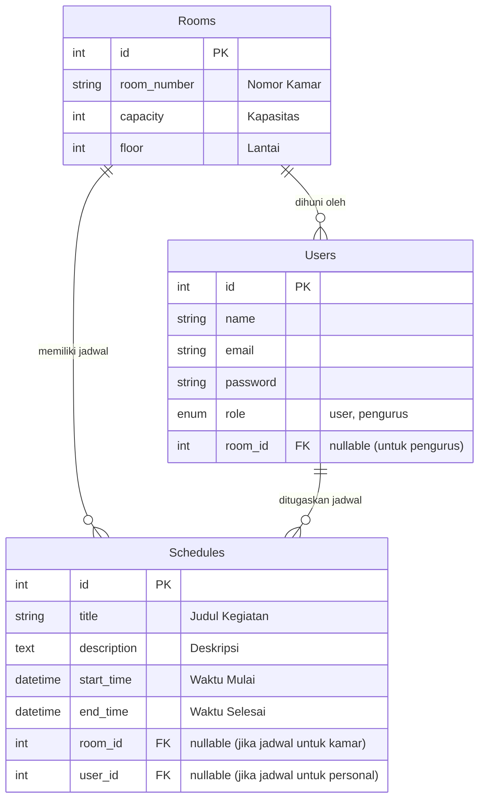

# Rencana Implementasi: Jadwal Asrama

Dokumen ini merangkum rencana fitur, alur database, serta langkah-langkah pengerjaan dari aplikasi Jadwal Asrama untuk peran **User** (penghuni asrama) dan **Pengurus** (admin asrama).

## 1. Urutan Pengerjaan

Sangat disarankan untuk mulai dari Skema Database dan Backend terlebih dahulu. 
Alasannya: Frontend membutuhkan data untuk ditampilkan. Jika kita membuat database dan API (Backend) terlebih dahulu, maka saat membangun UI Frontend (halaman User & Pengurus), kita sudah punya data nyata untuk diuji coba. 

Jadi urutan pengerjaannya adalah:
1. **Skema Database & Backend Models**
2. **Backend API (Routes & Controllers)** untuk fitur-fitur
3. **Frontend UI** (Pages untuk User & Pengurus) dan integrasi dengan Backend

---

## 2. Rencana Fitur Aplikasi

Aplikasi akan dibagi menjadi 2 halaman utama di dalam folder `frontend/src/pages/`, yaitu `User/` dan `Pengurus/`.

### 🗂️ Halaman Pengurus (Admin)
- **Login Pengurus**: Akses masuk khusus pengurus.
- **Dashboard Pengurus**: Ringkasan data (total penghuni, total kamar, jadwal hari ini).
- **Manajemen Kamar (Rooms)**: Tambah, edit, hapus, dan lihat daftar kamar asrama.
- **Manajemen User (Penghuni)**: Mendaftarkan penghuni baru dan mengalokasikannya ke kamar tertentu.
- **Manajemen Jadwal (Schedules)**: Membuat jadwal (misal: jadwal kebersihan, piket, atau kegiatan) dan menugaskannya ke kamar tertentu atau user tertentu.

### 🗂️ Halaman User (Penghuni)
- **Login User**: Akses masuk dengan email & password yang dibuatkan oleh Pengurus.
- **Dashboard User**: Menampilkan informasi profil diri dan kamar saat ini.
- **Lihat Jadwal**: Melihat daftar jadwal kegiatan atau jadwal piket yang ditugaskan kepada User tersebut atau kamar tempat User berada.

---

## 3. Diagram Database (ERD)

Berikut adalah *flowchart/diagram* dari database yang akan kita buat menggunakan MySQL dan dihubungkan menggunakan Sequelize ORM.

**Penjelasan Alur Database:**
- **Rooms (Kamar)** adalah entitas pusat. Satu kamar bisa dihuni oleh banyak **Users**.
- **Schedules (Jadwal)** sangat fleksibel. Pengurus bisa membuat jadwal yang ditujukan untuk seluruh anggota di sebuah **Room** (misal: *Jadwal Kebersihan Kamar 101*), atau ditujukan khusus untuk satu **User** (misal: *Piket Harian Budi*).
