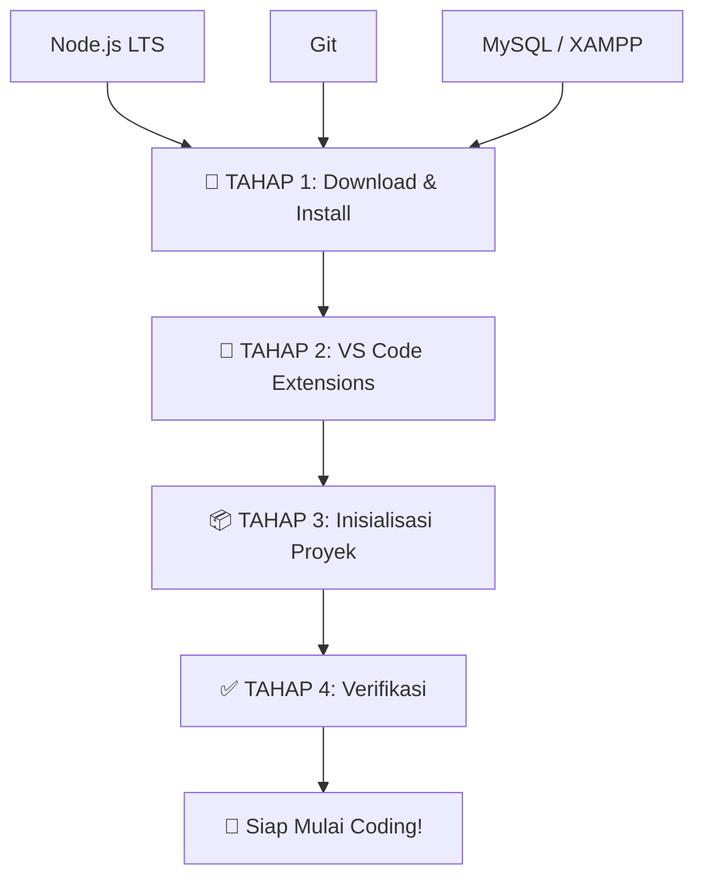

# 🛠️ Persiapan Development Environment — Jadwal Asrama Digital

> **Stack**: Full-Stack **TypeScript** — React + Vite + Tailwind (Frontend) | Express.js + MySQL (Backend)

Sebelum mulai ngoding, kita harus install semua tools yang dibutuhkan dan inisialisasi proyek dengan benar.

## 📋 Ringkasan Tech Stack

| Layer | Teknologi | Versi |
|-------|-----------|-------|
| **Bahasa** | **TypeScript** | v5.x |
| **Runtime** | Node.js | LTS (v22.x) |
| **Frontend** | React + Vite + Tailwind CSS | React 19, Vite 6, Tailwind 4 |
| **Backend** | Express.js | v5.x |
| **Database** | MySQL | v8.x |
| **Version Control** | Git | Latest |
| **Editor** | VS Code | Latest |

---

## 🔽 TAHAP 1: Download & Install Software

Kamu perlu download dan install software berikut secara **berurutan**:

### 1.1 — Node.js (WAJIB PERTAMA)
- **Download**: https://nodejs.org/ → Pilih **LTS** (Long Term Support)
- **Versi**: v22.x LTS
- **Saat install**: ✅ Centang "Automatically install the necessary tools" jika muncul
- **Verifikasi** setelah install, buka PowerShell/Terminal:
  ```bash
  node --version    # Harus muncul v22.x.x
  npm --version     # Harus muncul v10.x.x
  ```

### 1.2 — Git (WAJIB)
- **Download**: https://git-scm.com/download/win
- **Saat install**: Pilih default semua, pastikan "Git from the command line" tercentang
- **Verifikasi**:
  ```bash
  git --version     # Harus muncul git version 2.x.x
  ```
- **Konfigurasi awal** (setelah install):
  ```bash
  git config --global user.name "Nama Kamu"
  git config --global user.email "email@kamu.com"
  ```

### 1.3 — MySQL (WAJIB)
- **Download**: https://dev.mysql.com/downloads/installer/ → Pilih **MySQL Installer for Windows**
- **Pilih**: "Developer Default" atau "Custom" (pilih MySQL Server + MySQL Workbench)
- **Saat setup**:
  - Port: `3306` (default)
  - Root password: **catat baik-baik!**
  - Buat user baru untuk project (opsional tapi direkomendasikan)
- **Verifikasi**:
  ```bash
  mysql --version
  ```

> [!TIP]
> **Alternatif MySQL**: Kamu juga bisa pakai **XAMPP** yang sudah include MySQL (MariaDB) + phpMyAdmin. Lebih mudah untuk pemula. Download di https://www.apachefriends.org/

---

## 🧩 TAHAP 2: VS Code Extensions

Install extensions berikut di VS Code (berdasarkan rekomendasi dari gambar yang kamu kirim):

### Wajib (Code Quality & Formatting)
| Extension | Fungsi |
|-----------|--------|
| **Prettier** | Auto format kode supaya rapi |
| **ESLint** | Deteksi error & improve kualitas kode |
| **Error Lens** | Highlight error langsung di baris kode |

### Wajib (TypeScript & React)
| Extension | Fungsi |
|-----------|--------|
| **TypeScript Importer** | Auto import TypeScript modules |
| **Pretty TypeScript Errors** | Error TypeScript lebih mudah dibaca |
| **ES7+ React/Redux Snippets** | Shortcut cepat buat komponen React |
| **React Snippets** | Template React component generation |
| **Tailwind CSS IntelliSense** | Autocomplete class Tailwind |

### Wajib (Produktivitas HTML/CSS)
| Extension | Fungsi |
|-----------|--------|
| **Auto Rename Tag** | Otomatis rename closing tag saat edit opening tag |
| **HTML CSS Support** | Autocomplete CSS class di HTML |
| **IntelliSense for CSS class names** | Smart CSS class suggestions |

### Rekomendasi (Developer Power Tools)
| Extension | Fungsi |
|-----------|--------|
| **GitLens** | Lihat history Git, siapa yang edit, dll |
| **Path Intellisense** | Autocomplete file path saat import |
| **Image Preview** | Preview gambar langsung di editor |
| **Thunder Client** | Test API langsung dari VS Code (alternatif Postman) |
| **MySQL** (by Weijan Chen) | Koneksi & kelola database MySQL dari VS Code |

> [!NOTE]
> Saya akan otomatis membuat file `.vscode/extensions.json` supaya VS Code merekomendasikan extensions ini saat kamu buka project.

---

## 📦 TAHAP 3: Inisialisasi Proyek

Setelah semua software terinstall, saya akan melakukan hal berikut:

### 3.1 — Frontend (React + Vite + Tailwind CSS + TypeScript)

```
frontend/
├── public/
├── src/
│   ├── assets/          # Gambar, font, dll
│   ├── components/      # Komponen reusable
│   │   ├── common/      # Button, Input, Modal, dll
│   │   ├── layout/      # Navbar, Sidebar, Footer
│   │   └── ui/          # Card, Badge, dll
│   ├── context/         # React Context (state management)
│   ├── hooks/           # Custom hooks
│   ├── pages/           # Halaman-halaman
│   ├── routes/          # React Router config
│   ├── services/        # API calls (axios)
│   ├── store/           # State management
│   ├── types/           # TypeScript type definitions
│   ├── utils/           # Helper functions
│   ├── App.tsx          # ← .tsx (TypeScript + JSX)
│   └── main.tsx         # ← .tsx
├── .env
├── package.json
├── tailwind.config.ts   # ← .ts
├── tsconfig.json        # ← TypeScript config
├── tsconfig.node.json   # ← TypeScript config untuk Vite
└── vite.config.ts       # ← .ts
```

**Dependencies yang akan diinstall:**
- `react`, `react-dom` — UI library
- `react-router-dom` — Navigasi halaman
- `axios` — HTTP client untuk API calls
- `tailwindcss`, `@tailwindcss/vite` — Styling
- `react-icons` — Icon pack
- `react-hot-toast` — Notifikasi toast
- `dayjs` — Manipulasi tanggal/waktu

**TypeScript & Dev Dependencies:**
- `typescript` — TypeScript compiler
- `@types/react`, `@types/react-dom` — Type definitions untuk React
- `@vitejs/plugin-react` — Vite plugin untuk React

### 3.2 — Backend (Express.js + MySQL + TypeScript)

```
backend/
├── src/
│   ├── config/          # Database config, env config
│   ├── controllers/     # Logic handler
│   ├── middleware/       # Auth, error handler, dll
│   ├── models/          # Sequelize models (tabel database)
│   ├── routes/          # API endpoints
│   ├── services/        # Business logic
│   ├── types/           # TypeScript type definitions
│   ├── uploads/         # File uploads
│   ├── utils/           # Helper functions
│   ├── validations/     # Input validation
│   ├── app.ts           # ← .ts (TypeScript)
│   └── server.ts        # ← .ts
├── .env
├── package.json
└── tsconfig.json        # ← TypeScript config
```

**Dependencies yang akan diinstall:**
- `express` — Web framework
- `mysql2` — MySQL driver
- `sequelize` — ORM (Object Relational Mapping)
- `cors` — Cross-origin resource sharing
- `dotenv` — Environment variables
- `bcryptjs` — Hash password
- `jsonwebtoken` — JWT authentication
- `express-validator` — Input validation
- `multer` — File upload

**TypeScript & Dev Dependencies:**
- `typescript` — TypeScript compiler
- `tsx` — Jalankan TypeScript langsung tanpa compile (pengganti nodemon + ts-node)
- `@types/express`, `@types/cors`, `@types/bcryptjs`, `@types/jsonwebtoken`, `@types/multer` — Type definitions
- `@types/node` — Type definitions untuk Node.js

### 3.3 — Root Project

- `package.json` root dengan scripts untuk menjalankan frontend & backend bersamaan
- `.gitignore` untuk mengabaikan node_modules, .env, dll
- `README.md` dokumentasi proyek

---

## ✅ TAHAP 4: Verifikasi Semua Berjalan

Setelah inisialisasi, saya akan verifikasi:

1. ✅ `npm run dev` di frontend → React app muncul di browser
2. ✅ `npm run dev` di backend → Server Express berjalan
3. ✅ Koneksi ke MySQL berhasil
4. ✅ Frontend bisa call API ke backend
5. ✅ Git repository terinisialisasi

---

## 🚦 Urutan Kerja



---

## ⚠️ User Review Required

> [!IMPORTANT]
> **Sebelum saya mulai, kamu perlu:**
> 1. **Download & install Node.js** dulu dari https://nodejs.org/ (pilih LTS)
> 2. **Download & install Git** dari https://git-scm.com/download/win
> 3. **Pilih salah satu untuk MySQL**:
>    - **MySQL Installer** (resmi) — https://dev.mysql.com/downloads/installer/
>    - **XAMPP** (lebih mudah, include phpMyAdmin) — https://www.apachefriends.org/
> 4. Setelah semua terinstall, **bilang ke saya** dan saya akan lanjut ke Tahap 2-4 (install extensions, inisialisasi proyek, verifikasi)

## ✅ Keputusan yang Sudah Diambil

| Keputusan | Pilihan |
|-----------|---------|
| **Bahasa** | TypeScript ✅ |
| **Database** | MySQL ✅ |
| **Styling** | Tailwind CSS ✅ |

## Open Questions

> [!IMPORTANT]
> 1. **MySQL**: Mau pakai **MySQL Installer resmi** atau **XAMPP** (lebih mudah untuk pemula)?
> 2. Apakah ada **software lain** yang sudah kamu install sebelumnya? (supaya tidak double install)
